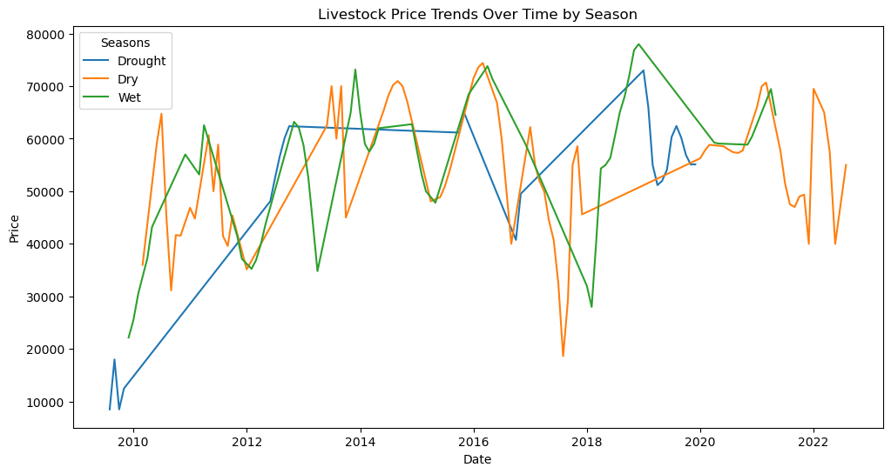
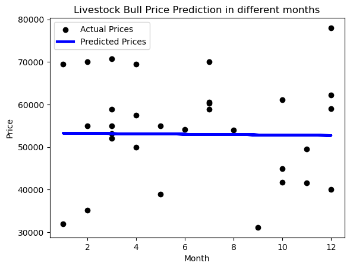
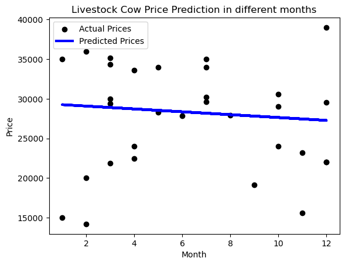
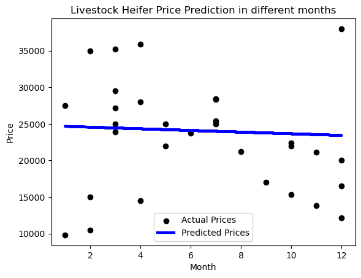
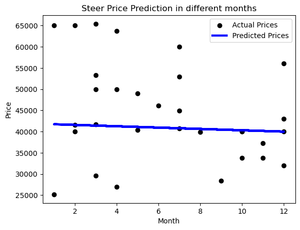

```python
import pandas as pd
import numpy as np
import matplotlib.pyplot as plt
import seaborn as sns
from sklearn.model_selection import train_test_split
from sklearn.linear_model import LinearRegression
from sklearn.metrics import mean_squared_error
```


```python

excel_file_path = 'C:/Users/Martin Omollo/Downloads/Makert Prices 2022.xlsx'

# Loading data from Excel file into a Pandas DataFrame
df = pd.read_excel(excel_file_path)

```


```python
print(df.head(10))
```

           Dates  Seasons          Bull           Cow        Heifer         Steer
    0 2009-08-01  Drought   8500.000000    966.666667   1666.666667    766.666667
    1 2009-09-01  Drought  18000.000000   4000.000000  15000.000000  13000.000000
    2 2009-10-01  Drought   8500.000000   5000.000000   8000.000000   9000.000000
    3 2009-11-01  Drought  12484.312740   4815.021851   5198.550137  11302.715033
    4 2012-06-01  Drought  48110.237678  16155.568798   6112.813217  41987.924940
    5 2012-07-01  Drought  52462.440497  18254.719392   6184.831231  41892.276660
    6 2012-08-01  Drought  56649.650013  20717.821204   6677.324707  41703.446301
    7 2012-09-01  Drought  60113.034720  23283.948018   7564.133603  41419.453573
    8 2012-10-01  Drought  62386.406662  25678.987274   8768.628788  41050.498176
    9 2015-10-01  Drought  61165.886530  30565.609337  22355.109883  39950.752206
    


```python
# Checking for missing values
print(df.isnull().sum())
```

    Dates      0
    Seasons    0
    Bull       0
    Cow        0
    Heifer     0
    Steer      0
    dtype: int64
    


```python
# Visualizing price trends over time by season
plt.figure(figsize=(12, 6))
sns.lineplot(x='Dates', y='Bull', hue='Seasons', data=df)
plt.title('Livestock Price Trends Over Time by Season')
plt.xlabel('Date')
plt.ylabel('Price')
plt.show()
```


    

    


```python
df['Month'] = df['Dates'].dt.month
df['Quarter'] = df['Dates'].dt.quarter

```


```python
from sklearn.model_selection import train_test_split
from sklearn.linear_model import LinearRegression
from sklearn.metrics import mean_squared_error

# I want to predict 'Bull' prices based on 'Month'
X = df[['Month']]
y = df['Bull']

# Spliting the data into training and testing sets
X_train, X_test, y_train, y_test = train_test_split(X, y, test_size=0.2, random_state=42)

# I Fitted a linear regression model
model = LinearRegression()
model.fit(X_train, y_train)

# Made predictions on the test set
y_pred = model.predict(X_test)

# Evaluating the model
mse = mean_squared_error(y_test, y_pred)
print(f'Mean Squared Error: {mse}')

# Visualizing the predictions
plt.scatter(X_test, y_test, color='black', label='Actual Prices')
plt.plot(X_test, y_pred, color='blue', linewidth=3, label='Predicted Prices')
plt.title('Bull Price Prediction in different months')
plt.xlabel('Month')
plt.ylabel('Price')
plt.legend()
plt.show()

```

    Mean Squared Error: 141813927.44443175
    


    

    


```python
from sklearn.model_selection import train_test_split
from sklearn.linear_model import LinearRegression
from sklearn.metrics import mean_squared_error

# predicting 'Cow' prices based on 'Month'
X = df[['Month']]
y = df['Cow']

# I splitted the data into training and testing sets
X_train, X_test, y_train, y_test = train_test_split(X, y, test_size=0.2, random_state=42)

# Fitted a linear regression model
model = LinearRegression()
model.fit(X_train, y_train)

# Make predictions on the test set
y_pred = model.predict(X_test)

# Evaluating the model
mse = mean_squared_error(y_test, y_pred)
print(f'Mean Squared Error: {mse}')

# I Visualize the predictions
plt.scatter(X_test, y_test, color='black', label='Actual Prices')
plt.plot(X_test, y_pred, color='blue', linewidth=3, label='Predicted Prices')
plt.title('Cow Price Prediction in different months')
plt.xlabel('Month')
plt.ylabel('Price')
plt.legend()
plt.show()

```

    Mean Squared Error: 44049562.829600066
    


    

    


```python
from sklearn.model_selection import train_test_split
from sklearn.linear_model import LinearRegression
from sklearn.metrics import mean_squared_error

# predicting 'Heifer' prices based on 'Month'
X = df[['Month']]
y = df['Heifer']

# Split the data into training and testing sets
X_train, X_test, y_train, y_test = train_test_split(X, y, test_size=0.2, random_state=42)

# Fitte a linear regression model
model = LinearRegression()
model.fit(X_train, y_train)

# Made predictions on the test set
y_pred = model.predict(X_test)

# Evaluated the model
mse = mean_squared_error(y_test, y_pred)
print(f'Mean Squared Error: {mse}')

# Visualize the predictions
plt.scatter(X_test, y_test, color='black', label='Actual Prices')
plt.plot(X_test, y_pred, color='blue', linewidth=3, label='Predicted Prices')
plt.title('Heifer Price Prediction in different months')
plt.xlabel('Month')
plt.ylabel('Price')
plt.legend()
plt.show()
```

    Mean Squared Error: 54680610.75136596
    


    

    


```python
from sklearn.model_selection import train_test_split
from sklearn.linear_model import LinearRegression
from sklearn.metrics import mean_squared_error

#predicting 'Steer' prices based on 'Month'
X = df[['Month']]
y = df['Steer']

# Spliting the data into training and testing sets
X_train, X_test, y_train, y_test = train_test_split(X, y, test_size=0.2, random_state=42)

# Fitting a linear regression model
model = LinearRegression()
model.fit(X_train, y_train)

# Made predictions on the test set
y_pred = model.predict(X_test)

# Evaluating the model
mse = mean_squared_error(y_test, y_pred)
print(f'Mean Squared Error: {mse}')

# Visualizing the predictions
plt.scatter(X_test, y_test, color='black', label='Actual Prices')
plt.plot(X_test, y_pred, color='blue', linewidth=3, label='Predicted Prices')
plt.title('Steer Price Prediction in different months')
plt.xlabel('Month')
plt.ylabel('Price')
plt.legend()
plt.show()
```

    Mean Squared Error: 138020550.99530774
    


    

    


# My model Analysis (Description, Documentation, and recommandation to livestock farmers)

### From general analysis there is variation in sales every year in all seasons, these are based on different climatic conditions every year.
### To give recommendtion to farmers I narrowed it down to months of the years, I got a continuous and predictable trends, across the months all these years.
### There are months which farmers had high brices on their animals(Bull, Cow, Heifer and Steer).
### My recommendation and analysis on best/advantageous months to sell are drawn from these reality in the analysis.


### The farmers I would recommend to make their sale on early months of the year (between January to May). The advantage of this is that there is high chances they will sell the livestock at a very high or good prices. Though  the main disadvantage of this is selling their livestock at a very low prices in rare occassion.

### The sales toward end of the year are just moderate hence giving the disadvatage of farmers not earning very good amount from sales. Its main advatage is that prices are a bit stable hence no extreme losses from sales


```python

```
